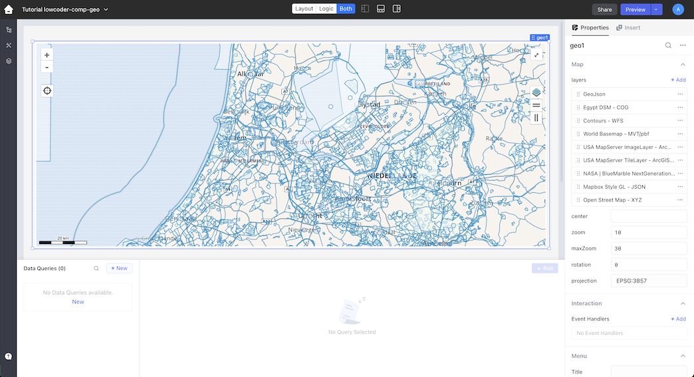

# Creating the lowcoder-comp-geo demo

Here we explain how we have created the demo app you can
<a href='lowcoder-example/lowcoder-comp-geo.json' download="lowcoder-comp-geo.json"> download here</a>

We start with the `base config` when you drop the plugin on an empty application 


## Step 1 - Configure component


Now we will remove all layers except the `Open Street Map - XYZ` by clicking on `...` on each layer and select `Delete`

By default this layer is `invisible`. By clicking on the layer name, the edit window will open. Toggle the visible flag to true to show the layer.

Now scroll down to behavior section of the properties and toggle the following items on: `modify`,`save` and turn the following items off: `horizontal`, `vertical` split screen.

<br clear="right"/>

## Step 2 - Connect onModify event


Add an new interaction by clicking `+Add` on the right side of Event Handlers. Select the `onModify` event and for Action `Run Javascript`. Copy the javascript below into the script field. Set the bounce to 0.5s to reduce the number of modify events

```js
localStorage.setItem('draw',geo1.getFeatures('draw'))
})
```
<br clear="right"/>

## Step 3 - Connect onInit load event


Add an new interaction by clicking `+Add` on the right side of Event Handlers. Select the `onInit` event and for Action `Run Javascript`. Copy the javascript below into the script field. This javascript load the information stored for the draw value into the layer.

```js
geo1.setFeatures('draw',localStorage.values.draw,true)
```
<br clear="right"/>

## Step 4 - Start drawing


Toggle one of the draw buttons and start drawing features on the screen. To stop drawing you need to toggle the button again.

When you would refresh the browser you will see that all features are loaded from the local storage.